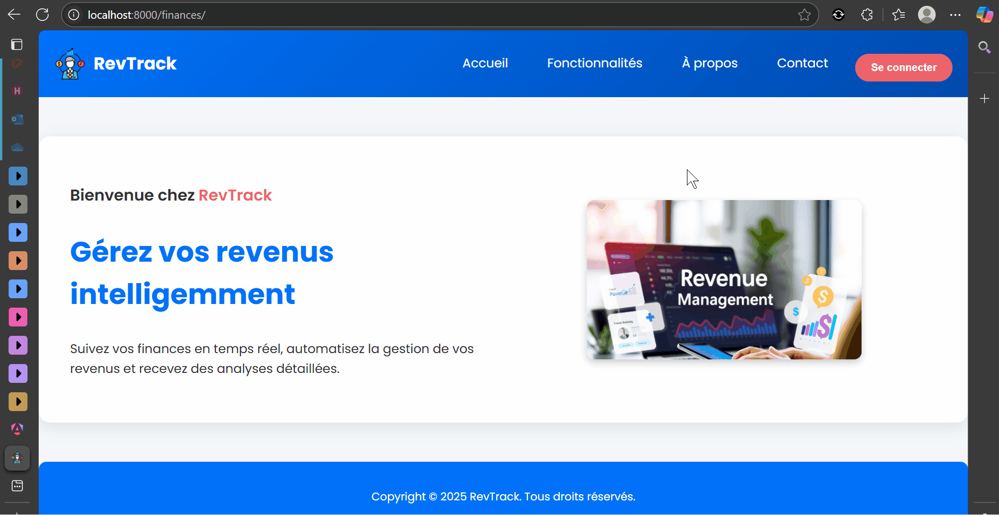

# 💰 Gestion de Finances - Projet Django + Docker + Kubernetes

Ce projet est une application web de gestion de dépenses et revenus développée avec **Django**, **MySQL**, **Docker** et **Kubernetes**. Il permet à un utilisateur de :

- Ajouter, modifier, supprimer des **dépenses** et **revenus**
- Associer une **catégorie** à chaque revenu ou dépense
- Filtrer les données par **mois**, **année**, et **catégorie**
- Voir la **liste des transactions**
- Visualiser des **statistiques dynamiques** : graphiques mensuels, répartition par catégories
- Gérer son **compte utilisateur** (inscription, connexion, déconnexion)
- Être averti avec des **confirmations visuelles (SweetAlert)** lors des suppressions

---

## 🔧 Technologies utilisées

- 🐍 **Django** (framework backend)
- 🐬 **MySQL** (base de données)
- 🐳 **Docker** (virtualisation des services)
- ☸️ **Kubernetes** (orchestration des conteneurs)
- 🧰 **Docker Compose** (environnement local simplifié)
- 📊 **Chart.js** (statistiques dynamiques)
- 💬 **SweetAlert2** (confirmation visuelle)
- 🎨 **HTML/CSS personnalisé**

---

## 🗂️ Structure du projet

```
gestion_finances/
│
├── finances/                     # Application Django principale
│   ├── models.py          # Revenus, Dépenses, Catégories
│   ├── views.py           # Logique des vues et filtres
│   ├── forms.py           # Formulaires Django
│   ├── static/                      # CSS
│   ├── templates/         # Fichiers HTML (ajout, édition, stats...)
│   └── ...
│
├── docker-compose.yml           # Déploiement local multi-conteneurs
├── Dockerfile                   # Image de l'application Django
├── requirements.txt             # Dépendances Python
├── deployment.yml               # Fichiers de déploiement Kubernetes
├── service.yml
│
└── README.md
```

---

## ⚙️ Installation en local avec Docker

### 1. Cloner le dépôt
```bash
git clone https://github.com/Teddy-Aimerick-TCHINDA-TAKUETE/gestion_depenses.git
cd gestion_depenses
```

### 2. Lancer avec Docker Compose
```bash
docker-compose up --build
```

### 3. Accéder à l’application
> http://localhost:8000

---

## 🚀 Déploiement sur Kubernetes

1. Créer une image Docker :
```bash
docker build -t gestion-finances .
```

2. Pousser sur Docker Hub (optionnel) :
```bash
docker tag gestion-finances votre_user/gestion-finances
docker push votre_user/gestion-finances
```

3. Appliquer les fichiers de déploiement :
```bash
kubectl apply -f deployment.yml
kubectl apply -f service.yml
```

---

## 🔐 Fonctionnalités principales

| Fonction                      | Description                                  |
|-------------------------------|----------------------------------------------|
| 🔐 Authentification           | Inscription / Connexion                      |
| ➕ Ajouter une dépense         | Formulaire dédié                             |
| ✏️ Modifier une dépense        | Champs préremplis                            |
| ❌ Supprimer une dépense       | Confirmation SweetAlert                      |
| 📊 Statistiques               | Vue récapitulative dynamique (Chart.js)      |
| 🗂️ Catégories                  | Pour revenus et dépenses                     |
| 🔎 Filtres                     | Par mois, année, catégorie                   |

---

## 🎥 Démonstration



---

## 🖼️ Captures d’écran

- Page de connexion ✅
- Tableau des dépenses ✅
- Boîte de confirmation suppression (SweetAlert) ✅
- Dashboard des revenus et dépenses (graphique) ✅
- Répartition par catégories (camembert) ✅
- Exemple d’architecture Docker ou Kubernetes ✅

---

## ✅ TODO / Améliorations futures

- [ ] Export PDF ou Excel des données
- [ ] Ajouter des notifications par e-mail
- [ ] Intégrer un front Angular ou React
- [ ] Ajouter des sous-catégories ou tags

---

## 👨‍💻 Auteur

> Projet réalisé par **Teddy** dans le cadre d’un apprentissage DevOps avec déploiement de projet Django via Docker et Kubernetes.

---

## 📝 Licence

Ce projet est libre sous licence MIT.